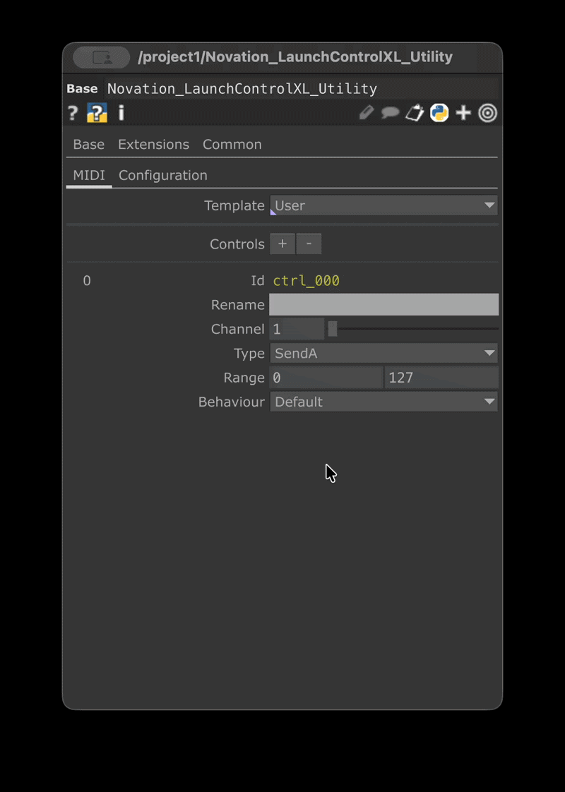

# Novation Launchcontrol XL Utility



## Équipements

Cette composante a été testé avec le _Novation LaunchControl MK2._ Le mappage des contrôles peut être adapté pour les autres versions du contrôleur.



## Configuration

#### 1. Installation

Glisser la composante Novation\_LaunchControlXL\_Utility.tox dans votre projet touchdesigner. Aucune installation supplémentaire est nécéssaire.

#### 2. Création et mappage



Un seul mappage est actif par défaut. Utilisez les symboles + / - dans Controls pour modifier ce nombre.



<figure><figcaption></figcaption></figure>






<figure><figcaption></figcaption></figure>



**RENAME:** Modifier le nom de l'assignation du canal pour cette piste.

**CHANNEL:** Choisissez la piste (colonne verticale) de votre contrôleur MIDI que vous souhaitez assigner.

**TYPE:** Choisissez le type de contrôle (potentiomètre ou fader) à assigner.

**RANGE**: Configurez l'amplitude (min/max) de la plage de données pour ce canal.

**BEHAVIOUR**: Définissez l'action du bouton ou du fader de votre contrôleur.&#x20;

* Default: Comportement standard (impulsion).&#x20;
* Toggle: Permet d'utiliser le bouton comme un interrupteur (On/Off).&#x20;
* Count: Incrémente une valeur à chaque pression du bouton (selon la plage définie).



