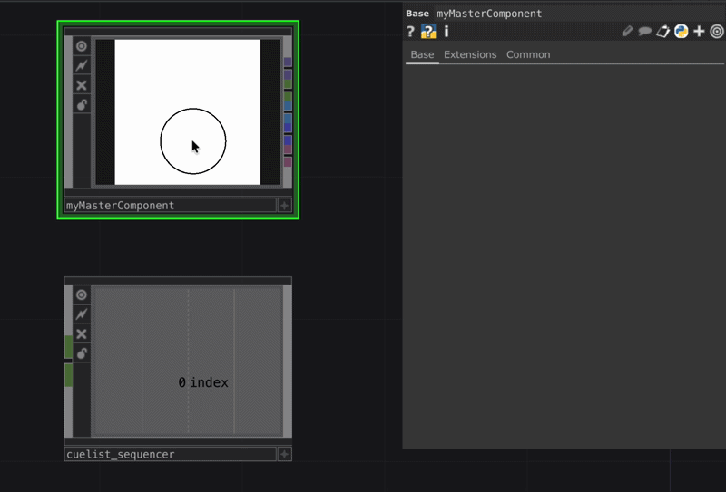
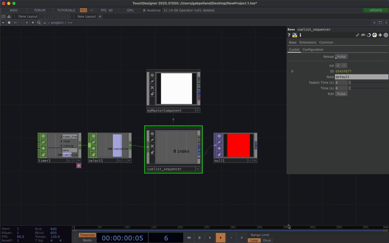
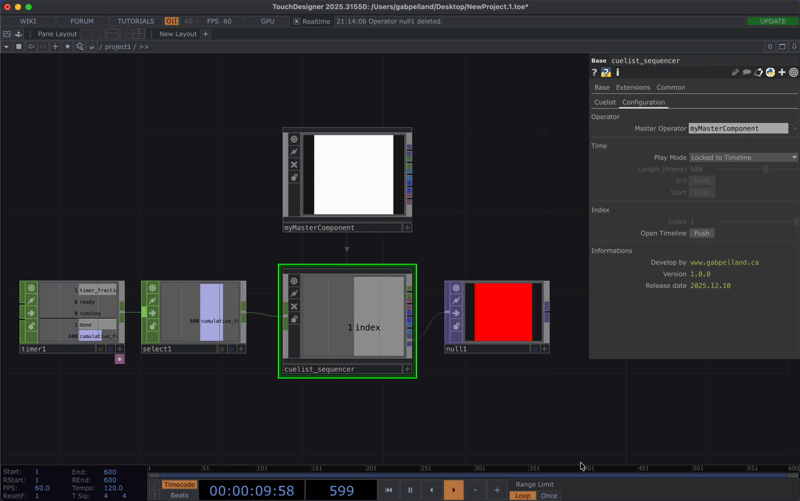

# Cuelist sequencer



## Instructions

### Installation

Glisser la composante cuelist\_sequencer.tox dans votre projet touchdesigner. Aucune installation supplémentaire est nécéssaire.

### Configuration

#### 1. Création du Master Component

La première étape consiste à désigner un Master Operator. Ce composant (un `COMP base`) constitue la scène principaleet le moteur logique de votre projet.

Chaque Cue créée dans le séquenceur représente une modification d'état ou une variation spécifique de cette scène. Le système enregistre les paramètres du Master pour chaque étape afin de générer des transitions fluides entre elles.

Prérequis des sorties (Outputs) : Pour transmettre les données au reste de votre réseau TouchDesigner, votre Master Component doit impérativement inclure des opérateurs de sortie parmi les types suivants :

* TOP&#x20;
* CHOP
* SOP
* POP
* DAT&#x20;

Le Cuelist sequencer expose automatiquement ces mêmes types de sorties sur ses propres connecteurs, reflétant ainsi le contenu de votre scène en temps réel.


Définissez l'ensemble de vos sorties (TOP, CHOP, SOP, POP, DAT) avant l'assignation du Master Component à la Cuelist. Une fois le composant lié et en cours d'utilisation, la configuration des types et du nombre de sorties devient fixe pour garantir la stabilité du flux de données.


<figure><figcaption></figcaption></figure>

#### 2. Sélectionner le mode de lecture

Le Cuelist Sequencer offre quatre méthodes distinctes pour piloter le défilement de vos cues. Choisissez le mode de lecture dans l'onglet `Configuration → Time`.

<table><thead><tr><th width="157.69921875">Mode</th><th>Description</th><th>Contrôles spécifiques</th></tr></thead><tbody><tr><td>Locked to Timeline</td><td>La lecture se synchronise directement sur la timeline globale de TouchDesigner.</td><td>Se base sur le <code>framecount</code> du projet.</td></tr><tr><td>Local Timer</td><td>Le séquenceur utilise son propre moteur de temps interne pour une gestion autonome.</td><td>Définissez la durée en images (Length) et utilisez les boutons Init et Start.</td></tr><tr><td>Frame Input</td><td>Le pilotage s'effectue via un signal externe connecté à l'entrée CHOP In du composant.</td><td>Idéal pour synchroniser la cuelist avec un Timer CHOP externe.</td></tr><tr><td>Manual Index</td><td>Le choix de la cue active s'effectue manuellement ou par référence de paramètre.</td><td>Utilisez le curseur Index pour naviguer directement entre les cues.</td></tr></tbody></table>

<figure><figcaption></figcaption></figure>

#### 3. Créer des cues

Une fois votre Master Operator configuré, rendez-vous dans l'onglet Cuelist pour bâtir votre séquence. Chaque cue enregistre l'état de votre scène à un instant précis.



**Ajouter ou supprimer des Cues**

* Bouton « + » : Ajoute une nouvelle cue à la suite de la liste.
* Bouton « - » : Supprime la cue dernière de la séquence.

**Paramètres d'une Cue**

Pour chaque cue créée, vous disposez des réglages suivants :

* Note : Champ libre pour nommer la cue (ex: "Intro", "Chorus", "Blackout"). Cela facilite l'organisation et la lecture de la séquence.
* Time (s) : Définit le point d'activation de la cue sur la timeline, exprimé en secondes à partir de zéro.
* FadeIn Time (s) : Détermine la durée de la transition fluide (interpolation) entre la cue précédente et la cue actuelle. Une valeur de 0 déclenche un changement instantané.



<figure><figcaption></figcaption></figure>




**L'outil d'édition : Edit (Pulse)**

Le bouton Edit est l'élément central pour la création de vos contenus.

* Accès direct : Une pression sur Edit ouvre instantanément le réseau interne de votre Master Operator.
* Configuration des presets : Ce mode permet d'ajuster précisément la logique interne, les paramètres visuels ou les valeurs de sortie spécifiques à la cue sélectionnée.

<figure><figcaption></figcaption></figure>


Le bouton Reload est indispensable pour valider vos modifications.


### Visualisation de la séquence

Pour obtenir une représentation visuelle de votre programmation, utilisez le bouton Open Timeline. Cette action affiche la timeline complète, vous permettant de superviser le déroulement des cues et la progression des transitions en temps réel.

<figure><figcaption></figcaption></figure>

